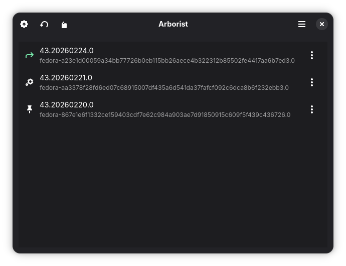

 
# Arborist
Manage your atomic deployments.

Arborist is a graphical utility to manage an atomic system. It provides an easy to use interface to help visualize and perform atomic transactions.

## Providers and Compatibility
Arborist was created with Fedora Silverblue and its derivatives in mind.

Currently, Arborist has support for these Atomic providers:
* rpm-ostree

## Building
Arborist makes use of AppImage to minimize dependencies and to allow access to the host system. Flatpak blocks the /run directory, which some Atomic providers require to run and monitor transactions.

Arborist has been built with a Fedora 43 Distrobox image.

Meson, GTK, libadwaita, and Python are required to build Arborist.

You will also need appimagetool, to obtain it run this command in the project root:

`wget https://github.com/AppImage/appimagetool/releases/download/continuous/appimagetool-x86_64.AppImage`

To build Arborist into an AppImage, simply run the Makefile:

`make`
